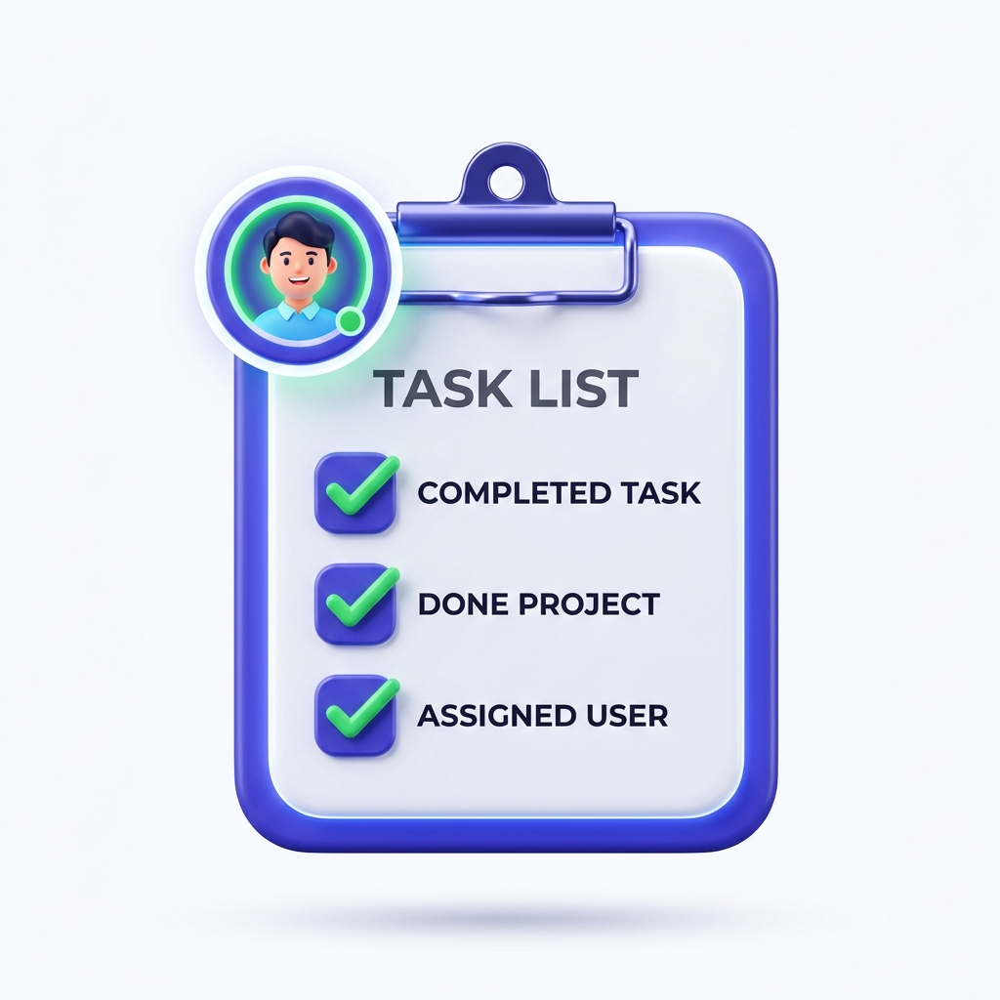

# 📖 MANUAL DE USO - CONTROL DE SOCIOS (GESTIÓN DEL CASAL v2.0)

<div align="center">
  
  <p><strong>Guía oficial para la administración del centro, secretaría y monitores</strong></p>
</div>

---

## 📑 Índice de Contenidos
1. [Acceso al Sistema e Identificación](#1-acceso-al-sistema-e-identificación)
2. [Barra Superior y Controles de Accesibilidad](#2-barra-superior-y-controles-de-accesibilidad)
3. [Módulo: Socios](#3-módulo-socios)
4. [Módulo: Cuotas Anuales](#4-módulo-cuotas-anuales)
5. [Módulo: Actividades y Talleres](#5-módulo-actividades-y-talleres)
6. [Módulo: Inscripciones](#6-módulo-inscripciones)
7. [Módulo: Asistencia / Pasar Lista (PC y Móvil con QR)](#7-módulo-asistencia--pasar-lista-pc-y-móvil-con-qr)
8. [Módulo: Monitores](#8-módulo-monitores)
9. [Módulo: Salas y Espacios](#9-módulo-salas-y-espacios)
10. [Módulo: Taqueras de Billar](#10-módulo-taqueras-de-billar)
11. [Módulo: Cuentas y Tesorería](#11-módulo-cuentas-y-tesorería)
12. [Módulo: Excursiones y Autobuses](#12-módulo-excursiones-y-autobuses)
13. [Módulo: Informes Oficiales y Listados](#13-módulo-informes-oficiales-y-listados)
14. [Módulo: Estadísticas](#14-módulo-estadísticas)
15. [Configuración, Copias de Seguridad (Backups) e Importación](#15-configuración-copias-de-seguridad-backups-e-importación)
16. [Preguntas Frecuentes y Ayuda Rápida](#16-preguntas-frecuentes-y-ayuda-rápida)

---

## 1. Acceso al Sistema e Identificación

Al abrir la aplicación, se mostrará la pantalla de autenticación protegida:

```
┌─────────────────────────────────────────────────────────┐
│               [ Logo Casal Canarus ]                    │
│                   INICIAR SESIÓN                        │
│                                                         │
│  Correo electrónico:  [ admin@casal.es              ]   │
│  Contraseña:          [ •••••••••••••               ]   │
│                                                         │
│                  [    ENTRAR    ]                       │
└─────────────────────────────────────────────────────────┘
```

1. Introduce tu **Correo electrónico** y tu **Contraseña**.
2. Haz clic en el botón azul **"Entrar"**.
3. Accederás al panel principal del Casal con todos los módulos activos.

---

## 2. Barra Superior y Controles de Accesibilidad

En la cabecera superior permanente dispones de las siguientes herramientas:

```
[Logo] GESTIÓN DEL CASAL v2.0   [A] [A+] [A++]   [⚙️ Configuración]   [🛠️ Procesos Especiales]   [📱 Conectar Móvil]   [👥 148 Socios]   [🟢 Conectado]
```

* **Selector de Tamaño de Letra (`A` `A+` `A++`)**: Permite agrandar el texto al instante para que todo el personal pueda leer cómodamente.
* **⚙️ Configuración**: Importación masiva inteligente de datos desde archivos Excel (.xlsx/.xls) o CSV.
* **🛠️ Procesos Especiales**: Copias de seguridad (descarga JSON), restauración y limpieza histórica de datos.
* **📱 Conectar Móvil**: Genera el código QR para que los monitores pasen lista desde su propio teléfono.
* **👥 Contador de Socios**: Muestra el censo total de socios activos en tiempo real.
* **Estado de Conexión**: 🟢 *Conectado* (datos sincronizados con la nube) o 🟡 *Conectando...*

---

## 3. Módulo: Socios


### ¿Para qué sirve?
Gestiona la ficha completa de todos los socios del centro: altas, modificaciones, bajas, búsquedas y carnets.

### ➕ Dar de alta a un socio nuevo:
1. Haz clic en la pestaña **"Socios"**.
2. Pulsa el botón azul **"+ Nuevo Socio"**.
3. Rellena el formulario:
   * **Nº de Socio**: Número identificativo.
   * **Nombre y Apellidos**: Datos principales.
   * **DNI / NIE / Pasaporte** y **Teléfono**.
   * **Fecha de Nacimiento**: La aplicación calcula automáticamente la edad y aplica la **exención de cuota a mayores de 90 años**.
   * **Dirección, Código Postal y Población**.
   * **Observaciones**: Teléfonos de familiares, alergias o notas de interés.
4. Haz clic en **"Guardar"**.

### 🔍 Buscar socios:
Escribe en la barra de búsqueda superior cualquier nombre, apellido, DNI o número de socio. La tabla se filtrará inmediatamente.

---

## 4. Módulo: Cuotas Anuales


### ¿Para qué sirve?
Lleva el control de cobro de las cuotas anuales del casal con historial de 3 años, cálculo de recaudación y registro de impagos.

### 💵 Resumen en pantalla:
* 🟢 **Recaudado**: Total en euros ingresados en el año seleccionado.
* 🟡 **Pendientes**: Número de socios que aún no han abonado la cuota anual.
* 🔵 **Exentos (+90)**: Socios de 90 o más años eximidos automáticamente de pago.

### 💳 Cómo cobrar una cuota:
1. Selecciona el **Año** en el selector superior.
2. Localiza al socio en la lista usando el buscador.
3. Haz clic en el botón **"Cobrar / Pagar"**.
4. Elige el método de pago: **Efectivo**, **Tarjeta** o **Transferencia**.
5. Confirma el cobro. El socio pasará a estado **PAGADO** en verde y se sumará al total recaudado.

---

## 5. Módulo: Actividades y Talleres


### ¿Para qué sirve?
Programa y organiza los talleres del centro (gimnasia, memoria, baile, coro, pintura, informática, etc.).

### ➕ Crear una nueva actividad:
1. Entra en **"Actividades"** y pulsa **"+ Nueva Actividad"**.
2. Indica:
   * **Nombre de la actividad**.
   * **Monitor/a responsable**.
   * **Sala / Espacio asignado**.
   * **Días de la semana** y **Horario** (hora inicio y fin).
   * **Plazas máximas / Aforo permitido**.
3. Haz clic en **"Guardar"**.

---

## 6. Módulo: Inscripciones


### ¿Para qué sirve?
Matricula a los socios en los talleres correspondientes y gestiona el aforo.

### 📝 Cómo inscribir a un socio:
1. Entra en **"Inscripciones"** y pulsa **"+ Nueva Inscripción"**.
2. Selecciona al **Socio** y la **Actividad**.
3. **Control de aforo**:
   * Si quedan plazas libres, el socio queda registrado como **Admitido**.
   * Si el aforo está completo, el sistema ofrece apuntarlo en **Lista de Espera** por orden de llegada.
4. Guarda la inscripción.

---

## 7. Módulo: Asistencia / Pasar Lista (PC y Móvil con QR)



### ¿Para qué sirve?
Registra la presencia diaria de los socios en cada sesión de taller.

### 🖥️ Opción 1: Pasar lista desde el ordenador del Casal
1. Ve a la sección **"Asistencia"**.
2. Selecciona el taller y la fecha del día.
3. Haz clic sobre cada alumno para marcarlo como **🟢 Presente** o **🔴 Ausente**.
4. Se guarda automáticamente en la nube.

### 📱 Opción 2: Conector Móvil (Para que los monitores pasen lista desde su propio teléfono)
1. En la pantalla del ordenador, pulsa el botón superior **"📱 Conectar Móvil"**.
2. Se mostrará un **Código QR**.
3. El monitor abre la cámara de su teléfono móvil (conectado a la misma red Wi-Fi del casal) y escanea el código QR.
4. En el móvil del monitor se abrirá la aplicación táctil:
   * Introduce su **PIN de 4 dígitos**.
   * Elige su clase del día.
   * Marca con toques en pantalla los socios asistentes.

---

## 8. Módulo: Monitores


### ¿Para qué sirve?
Registro del equipo de monitores, profesores y dinamizadores del casal.

* **Alta de monitor**: Nombre, apellidos, teléfono y especialidad.
* **PIN de acceso móvil**: Código numérico personal de 4 dígitos para que el monitor pueda identificarse en el conector móvil y pasar lista.

---

## 9. Módulo: Salas y Espacios


### ¿Para qué sirve?
Control de las aulas, salones y dependencias del centro (Salón de Actos, Gimnasio, Sala de Billar, Aula 1, etc.).
* Permite fijar el **Aforo máximo** por motivos de seguridad y prevención.
* Asignación de salas a las actividades para evitar solapamientos.

---

## 10. Módulo: Taqueras de Billar


### ¿Para qué sirve?
Gestión de los casilleros / taqueras de billar para guardar los tacos de los socios aficionados.

* **Mapa visual de taqueras**: Casillas con código de color (🟢 Libres / 🔴 Ocupadas).
* **Asignar**: Clic en una taquera libre > elegir socio > guardar asignación.
* **Liberar**: Clic en la taquera ocupada > confirmar liberación.

---

## 11. Módulo: Cuentas y Tesorería


### ¿Para qué sirve?
Libro contable de caja e ingresos/gastos generales del centro.

* **Añadir Apunte**: Pulsa **"+ Añadir Apunte"**.
* Elige si es **Ingreso** (donaciones, cuotas, lotería) o **Gasto** (material, mantenimiento, suministros).
* Especifica el **Importe (€)**, la fecha, el método de pago y el concepto.
* El sistema calcula automáticamente el **Saldo y Balance Total**.

---

## 12. Módulo: Excursiones y Autobuses

<div style="font-size: 2.5rem; color: #10b981; margin: 0.5rem 0;"><i class="fa-solid fa-bus"></i> <strong>Excursiones</strong></div>

### ¿Para qué sirve?
Organización completa de salidas culturales, viajes y excursiones.

1. **Crear Excursión**: Destino, fechas de viaje y precio por plaza.
2. **Añadir Autobuses**: Configura el autocar y abre el **plano interactivo de asientos**.
3. **Asignar Asiento al Socio**: Haz clic en el número de butaca, selecciona el socio y marca si el viaje está pagado o pendiente.
4. **Exportar PDF**: Genera e imprime el listado oficial de viajeros para el conductor.

---

## 13. Módulo: Informes Oficiales y Listados


### ¿Para qué sirve?
Generación e impresión inmediata de documentos oficiales en papel o formato PDF:

* 📄 **Censo General de Socios**: Listado completo por orden alfabético o número.
* ⚠️ **Listado de Cuotas Pendientes**: Relación de socios con cuotas impagadas.
* 📋 **Listados de Inscritos por Actividad**: Relación de alumnos por taller.
* 📝 **Hojas de Asistencia en Blanco**: Plantillas para firmas manuales.
* 🎱 **Listado de Taqueras**.

---

## 14. Módulo: Estadísticas

<div style="font-size: 2.5rem; color: #6366f1; margin: 0.5rem 0;"><i class="fa-solid fa-chart-pie"></i> <strong>Estadísticas</strong></div>

### ¿Para qué sirve?
Cuadro de mando visual con gráficas sobre el casal:
* **Pirámide de edad y distribución demográfica**.
* **Actividades con mayor ocupación y demanda**.
* **Evolución histórica de recaudación y asistencia**.

---

## 15. Configuración y Procesos Especiales
 
> 🛡️ **Seguridad de los datos**: Toda la información se almacena y sincroniza en la nube de Firebase Firestore. No obstante, se recomienda descargar una copia de seguridad periódicamente.
 
### 📊 Configuración (Importar desde Excel):
- Pulsa en el botón superior **"⚙️ Configuración"**.
- Si dispones de listados en Excel (.xlsx, .xls o .csv), selecciona el módulo a importar (Socios, Monitores, Actividades, Salas, Inscripciones o Cuotas), mapea las columnas y pulsa **"Iniciar Importación Masiva"**.
 
### 💾 Procesos Especiales:
Pulsa en el botón superior **"🛠️ Procesos Especiales"** para acceder a las funciones avanzadas:
 
1. **Descargar Copia de Seguridad**:
   - Pulsa en **"Copia de Seguridad"**.
   - Por seguridad, el sistema te solicitará escribir la palabra **`COPIAR`** para confirmar.
   - Se guardará un archivo `.json` con la fecha en tu equipo (incluye socios, actividades, excursiones, autobuses, cuotas, etc.).
 
2. **Restaurar Copia de Seguridad**:
   - Pulsa en **"Restaurar Copia de Seguridad"** y selecciona el archivo `.json` de respaldo.
   - El sistema mostrará un aviso y te solicitará escribir la palabra **`SOBREESCRIBIR`** para confirmar el reemplazo de los datos.
 
3. **Limpieza Histórica**:
   - Permite eliminar registros de años anteriores o resetear pagos trimestrales solicitando confirmación con la palabra **`ELIMINAR`**.

---

## 16. Preguntas Frecuentes y Ayuda Rápida

* **¿Cómo cambio el tamaño de letra si me cuesta leer?**  
  Pulsa en los botones **`A`**, **`A+`** o **`A++`** de la barra superior.

* **¿Por qué a un socio de 92 años no le pide cobrar cuota?**  
  La aplicación exime automáticamente del pago de cuota anual a los socios de **90 o más años** calculando su edad por la fecha de nacimiento.

* **¿Qué hacer si el monitor no puede escanear el QR?**  
  Comprueba que el móvil del monitor y el ordenador estén conectados a la **misma red Wi-Fi** del centro.

---
*Manual oficial de la aplicación de Gestión del Casal (Control de Socios v2.0).*
